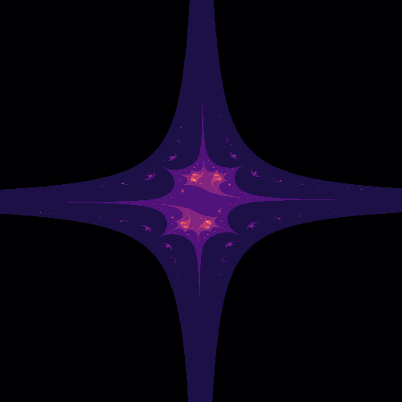

The idea for this code was given to me by Dr. Catherine Schuman, who wrote a code that turned people's names and birthdays in to factals for a Code with your Daughter event at ORNL. 

This program takes the letters in your name and assigns them each a numeric value. 
It then uses those values as inputs for an algorithm that creates a kind of fractal called a Mandelbrot.

I used OpenAI chat o1 to help me document and clean up the code. 

Please enjoy. Fork and modify – make it your own in every way and amplify how cool it is do math and programming. 
